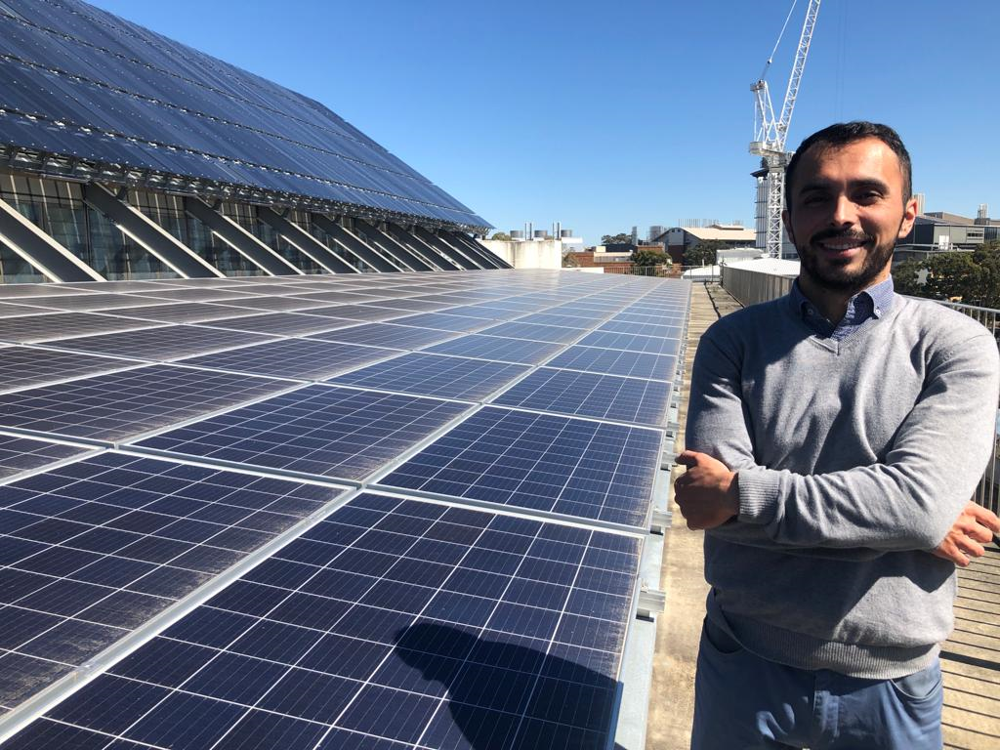

Hi folks! I am Max, a Ph.D. candidate at the the University of Queensland, Australia. [CV](files\cv.pdf)

I am passionate about research, particularly regarding applied economics and its intersection with other disciplines such as geography, environmental sciences, psychology, and beyond. I enjoy mathematical models and using advanced econometrics methods in R. My motivation is the plethora of knowledge and skills I would love to acquire, the unresolved questions, and those questions that are yet to be asked.

My hobbies are sports: tennis, soccer, cycling, and table tennis. I also enjoy craft beers, Stouts and IPA are my favourite styles.

A list of the scientific publications I have co-authored:

# Articles

1. **Maximiliano Alvarez**, Vicente Royuela, The effect of labour-market differentials on interregional migration in Spain: a meta-regression analysis. Journal of Regional Science. https://doi.org/10.1111/jors.12579

2. **Maximiliano Alvarez**, Aude Bernard, Scott N. Lieske, Understanding internal migration trends in OECD countries, Population, Space and Place, Volume 27, Issue 7, 2021, e2451. https://doi.org/10.1002/psp.2451

3. **Maximiliano Alvarez**, Distributional effects of environmental taxation: An approximation with a meta-regression analysis, Economic Analysis and Policy, Volume 62, 2019, https://doi.org/10.1016/j.eap.2018.10.003.

4. John Asafu-Adjaye, Dominic Byrne, **Maximiliano Alvarez**, Dataset for analysing the relationships among economic growth, fossil fuel and non-fossil fuel consumption, Data in Brief, Volume 10, 2017, Pages 17-19, https://doi.org/10.1016/j.dib.2016.11.076.

5. John Asafu-Adjaye, Dominic Byrne, **Maximiliano Alvarez**, Economic growth, fossil fuel and non-fossil consumption: A Pooled Mean Group analysis using proxies for capital, Energy Economics, Volume 60, 2016, Pages 345-356, https://doi.org/10.1016/j.eneco.2016.10.016.

# Working papers

1. Bernard, Aude, Elin Charles-Edwards, **Maximiliano Alvarez**, Pia Wohland, Julia Loginova, Sunganani Kalemba, Anticipating the impact of COVID-19 on internal migration, Centre for Population Research Paper, The Australian Government, Canberra, 2020, https://population.gov.au/sites/population.gov.au/files/2021-09/anticipating_the_impact_of_covid-19_on_internal_migration.pdf

2. **Maximiliano Alvarez**, Efectos distributivos de las políticas públicas para la mitigación del cambio climático en América Latina: una aproximación con un meta-análisis, Documentos de Proyectos, CEPAL, 2016, https://repositorio.cepal.org/bitstream/handle/11362/40297/S1600524_es.pdf?sequence=1&isAllowed=y
